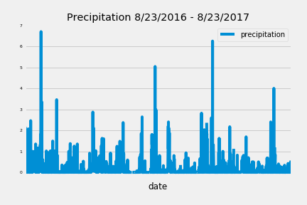
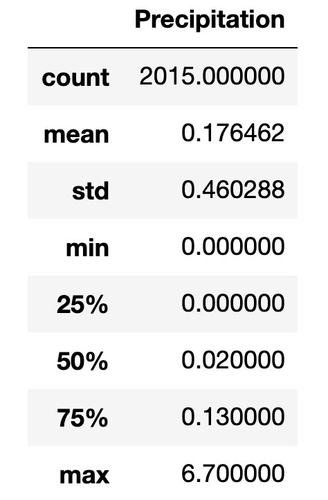
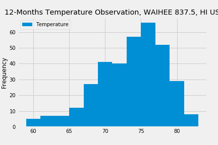
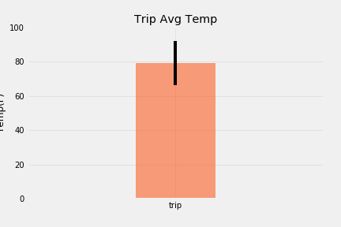
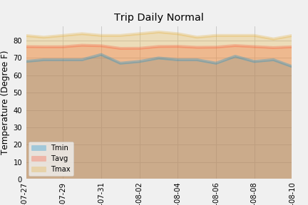

# Surfs Up!

Congratulations! You've decided to treat yourself to a long holiday vacation in Honolulu, Hawaii! To help with your trip planning, you need to do some climate analysis on the area. The following outlines what you need to do.

## Step 1 - Climate Analysis and Exploration

To begin, use Python and SQLAlchemy to do basic climate analysis and data exploration of your climate database. All of the following analysis should be completed using SQLAlchemy ORM queries, Pandas, and Matplotlib.

* [starter notebook](climate_starter.ipynb) and [hawaii.sqlite](Resources/hawaii.sqlite) files were used to complete climate analysis and data exploration.

* For this analysis, the trip is from 2019-07-27 to 2019-08-10.

### Precipitation Analysis

* The last data point in the database is 2017-08-23. A query was created to retrieve one year of precipitation data 2016-08-23 to 2017-08-23.
* A Precipitation chart was created using Pandas Plotting with Matplotlib.

  

* Pandas was used to print the summary statistics for the precipitation data.

### Station Analysis

* A query was created to calculate the total number of stations. There are a total of 9 stations.

* The most active station is USC00519281: WAIHEE 837.5, HI US, with 2772 obervations.

  
* A query was created to retrieve the last 12 months of temperature observation data (tobs).

  * Filter by the station with the highest number of observations.

  * Plot the results as a histogram with `bins=12`.

    

- - -

## Step 2 - Climate App

[A Flask API](Climate_App.py) was developed to return station, precipitation, temperature, and the temperature based on the trip date entered by users.

There are 5 available routes:
/api/v1.0/precipitation 
/api/v1.0/stations 
/api/v1.0/tobs 
/api/v1.0/datesearch/2016-08-01 
/api/v1.0/datesearch/2016-08-01/2016-08-10 
### Routes

* `/api/v1.0/precipitation`

  * Convert the query results to a Dictionary using `date` as the key and `prcp` as the value.

  * Return the JSON representation of your dictionary.

* `/api/v1.0/stations`

  * Return a JSON list of stations from the dataset.

* `/api/v1.0/tobs`
  * query for the dates and temperature observations from a year from the last data point.
  * Return a JSON list of Temperature Observations (tobs) for the previous year.

* `/api/v1.0/<start>` and `/api/v1.0/<start>/<end>`

  * Return a JSON list of the minimum temperature, the average temperature, and the max temperature for a given start or start-end range.

  * When given the start only, calculate `TMIN`, `TAVG`, and `TMAX` for all dates greater than and equal to the start date.

  * When given the start and the end date, calculate the `TMIN`, `TAVG`, and `TMAX` for dates between the start and end date inclusive.

### Optional: Other Recommended Analyses

* The following are optional challenge queries. These are highly recommended to attempt, but not required for the homework.

### Temperature Analysis I

* Monthly normal was calculated in June and December from all available months in eah station. Paired t-test was performed to see if there is a meaningful difference between the temperature in June and December.

* Paired t-test was used for the analysis since two dataset have the same station. Temperature in each station were collected in June and then December, results in pairs of observations.

* From the t-test, with p value of 0.0001, which is significantly < 0.05, null hypothesis is rejected. Therefore, the temperature in summer and winter are statistically significant different.

* However, with the temperature remains in the upper 60 degree F and lower 70 degree F in summer and winter, the difference is not practical significance.

### Temperature Analysis II

* The `calc_temps` function was used to calculate the min, avg, and max temperatures for your trip using the matching dates from the previous year, 2017-07-27 to 2017-08-10

* Plot the min, avg, and max temperature from previous query as a bar chart.

  * Use the average temperature as the bar height.

  * Use the peak-to-peak (tmax-tmin) value as the y error bar (yerr).

    

### Daily Rainfall Average

* The rainfall per weather station was calculated using the previous year's matching dates.

* The daily normals, which are the averages for the min, avg, and max temperatures, were calculated.

* A list of dates for the trip in the format `%m-%d` was created. The `daily_normals` function was used to calculate the normals for each date string and append the results to a list.

* The list of daily normals was loaded into a Pandas DataFrame and the index was set to the date.

* Pandas was used to plot an area plot (`stacked=False`) for the daily normals.

  

## Copyright

Data Boot Camp ©2019. All Rights Reserved.
